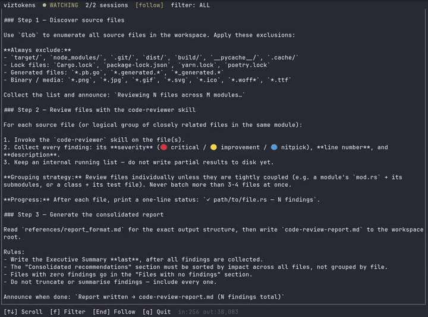

<p align="center">
  <a href="https://github.com/hansipie/viztokens/actions/workflows/ci.yml"></a>
  <a href="https://crates.io/crates/viztokens"></a>
  <a href="LICENSE"></a>
  <a href="https://www.rust-lang.org"></a>
</p>

A terminal UI that tails Claude Code's native JSONL session files and displays every harness ↔ model message in real time — user prompts, assistant responses, tool calls, and tool results, all with full untruncated content.

Claude Code requires zero configuration changes. viztokens reads the same files [ccusage](https://github.com/ryoppippi/ccusage) uses.




## Install

**From crates.io** (once published):
```bash
cargo install viztokens
```

**From GitHub** (latest commit):
```bash
cargo install --git https://github.com/hansipie/viztokens
```

**From source**:
```bash
git clone https://github.com/hansipie/viztokens
cd viztokens
cargo build --release
# Binary at ./target/release/viztokens
# Copy it anywhere on your PATH:
cp target/release/viztokens ~/.local/bin/
```

Requires Rust 1.78+ stable (`rustup update stable`) and at least one Claude Code session on disk.

## Update

Once installed, viztokens can update itself:

```bash
viztokens update
```

This runs `cargo install --git https://github.com/hansipie/viztokens --force` and replaces the current binary.

Alternatively, the manual equivalent:

```bash
cargo install --git https://github.com/hansipie/viztokens --force
```

## Usage

```bash
# Watch the most recent session
viztokens

# Watch a specific session by UUID
viztokens --session a1b2c3d4-...

# Watch the most recent session in one project
viztokens --project my-project

# Print all known sessions as JSON and exit
viztokens list-sessions

# Override the Claude config directory
viztokens --config-dir ~/.claude
CLAUDE_CONFIG_DIR=~/.claude viztokens

# Override the database path
viztokens --db /tmp/vt.db
VIZTOKENS_DB=/tmp/vt.db viztokens
```

## Keyboard shortcuts

| Key | Action |
|-----|--------|
| `↑` / `k` | Scroll up one line |
| `↓` / `j` | Scroll down one line |
| `PgUp` / `PgDn` | Scroll one page |
| `Home` | Jump to first message |
| `End` | Jump to latest; resume auto-follow |
| `f` | Cycle filter: ALL → USER → ASSISTANT → TOOLS → SYSTEM → ALL |
| `F` | Clear filter (show all types) |
| `1` / `2` / `3` / `4` | Toggle USER / ASSISTANT / TOOL CALL+RESULT / SYSTEM |
| `q` / `Ctrl+C` | Quit |

## Message types

| Block | Colour | What it shows |
|-------|--------|---------------|
| USER | Blue | Your typed prompt |
| ASSISTANT | Green | Model prose response — includes model name and token counts |
| TOOL CALL | Yellow | Tool name + full input JSON |
| TOOL RESULT | Cyan | Complete tool output |
| SYSTEM | Dark grey | System prompt entries |

## Token counts

Each ASSISTANT message title shows the model used and the input/output token counts for that exchange (e.g. `claude-opus-4-5  in:12,450 out:312`). The footer always shows the cumulative totals for all currently visible messages, updated live as the filter changes.

## Session discovery

viztokens searches for `.jsonl` files in this order:

1. `$CLAUDE_CONFIG_DIR/projects/`
2. `~/.claude/projects/`

The most recently modified session is selected automatically. History is persisted to `~/.local/share/viztokens/sessions.db` (SQLite) so you can scroll back through sessions started before viztokens was running.

## How it works

```
viztokens
├── Watcher task (tokio)
│   ├── notify::RecommendedWatcher on the session file's parent dir
│   ├── seeks to EOF on startup, reads newly appended bytes on Modify events
│   ├── parses each JSONL line → Vec<Message> (splits mixed assistant entries)
│   ├── deduplicates sidechain entries via SQLite index
│   └── sends messages through an mpsc channel
└── TUI task (ratatui + crossterm)
    ├── 100 ms tick loop, drains the channel each tick
    ├── coloured block per message, full content wrapped to terminal width
    ├── model name + token counts (in/out) in each message title
    ├── cumulative token totals in the footer, filtered by active message type
    ├── scroll_offset + follow_mode (End re-enables auto-follow)
    └── filter predicate applied at render time — no messages are discarded
```

SQLite writes go through `tokio::task::spawn_blocking`; the async task never blocks on I/O.

## Development

```bash
# Run tests
cargo test

# Run benchmarks (render p99 < 10 ms @ 10 000 messages; parse > 1 000 lines/s)
cargo bench

# Lint
cargo clippy -- -D warnings

# Format
cargo fmt
```
